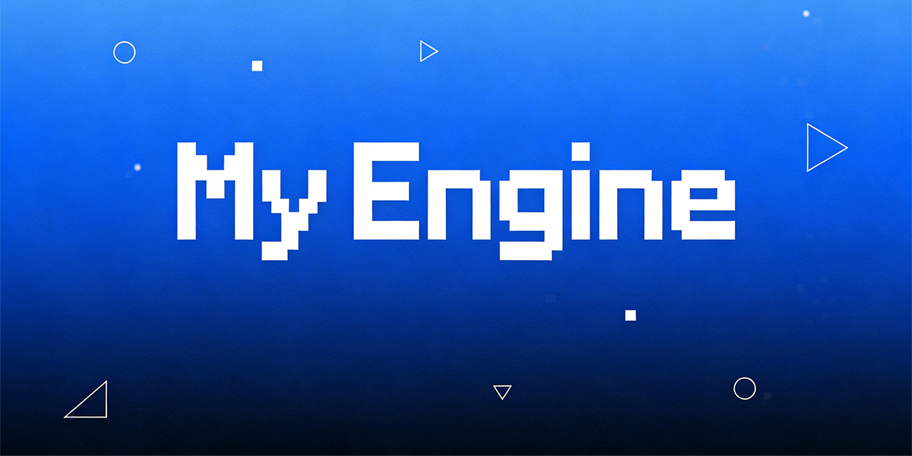
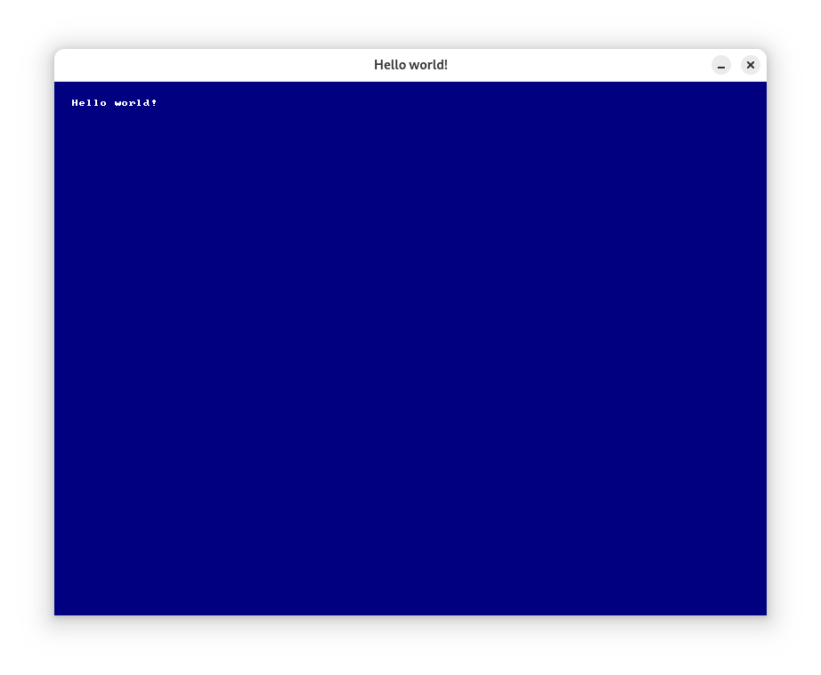

# MyEngine

[简体中文](README_zh.md)

  



MyEngine is a lightweight yet powerful 2D graphics framework built on top of SDL3 and its extensions. Designed for simplicity and flexibility, it provides an intuitive object-oriented API that makes game and application development fast and enjoyable. Leveraging modern C++20 features, MyEngine offers a modular architecture that allows developers to easily create interactive graphics applications with minimal boilerplate code.

## Version Log Updates

The project is currently under development. For detailed update content, please refer to the [Changelog](ChangeLog.md) file to learn about the latest version features.

## Environment Dependencies

To use this third-party library, you need to install the following dependencies, or you can install all dependency libraries at once through [Github Release](https://github.com/CatIsNotFound/MyEngine/releases/tag/requirements) or [Gitee Release](https://gitee.com/CatIsNotFound/MyEngine/releases/tag/requirements):

- [SDL](https://github.com/libsdl-org/SDL)
- [SDL_image](https://github.com/libsdl-org/SDL_image)
- [SDL_ttf](https://github.com/libsdl-org/SDL_ttf)
- [SDL_mixer](https://github.com/libsdl-org/SDL_mixer)

## Quick Start

### Getting Binary Version

Currently, no official version has been released yet. It is expected to be released early next year.

~~Precompiled versions can be obtained through [Github Release]() or [Gitee Release]() pages.~~

### Source Repository Installation

1. Clone the project using Git

   ```shell
   git clone https://github.com/CatIsNotFound/MyEngine
   ```
   
   Or clone the project using the following URL:

   ```shell
   git clone https://gitee.com/CatIsNotFound/MyEngine
   ```

2. Configure the project using CMake

   ```shell
   cd MyEngine
   mkdir build ; cd build
   cmake .. -DCMAKE_BUILD_TYPE="Release" -DCMAKE_INSTALL_PREFIX="/path/to/MyEngine" -DSDL3_LIB=/path/to/SDL3 -DSDL3_IMAGE_LIB=/path/to/SDL3_image -DSDL3_MIXER_LIB=/path/to/SDL3_mixer -DSDL3_TTF_LIB=/path/to/SDL3_ttf
   ```
   
   > ❗ Note:
   > 
   > You need to replace the shared library paths for `CMAKE_INSTALL_PREFIX`, `SDL3_LIB`, `SDL3_IMAGE_LIB`, `SDL3_TTF_LIB`, and `SDL3_MIXER_LIB`.

3. Compile and install the project

   ```shell
   cmake --build . --config install
   ```
   
### Minimal Example Test

1. Create a new `CMakeLists.txt` file and write the following content:

   ```cmake
    cmake_minimum_required(VERSION 3.24)
    # Need to modify your project name.
    project(Demo)
    
    set(CMAKE_CXX_STANDARD 20)
    
    # Need to set these paths before cmake configuration.
    set(SDL3_LIB       "/path/to/SDL3")
    set(SDL3_IMAGE_LIB "/path/to/SDL3_image")
    set(SDL3_TTF_LIB   "/path/to/SDL3_ttf")
    set(SDL3_MIXER_LIB "/path/to/SDL3_mixer")
    set(MYENGINE_LIB      "/path/to/MyEngine")
    set(CMAKE_INCLUDE_CURRENT_DIR ON)
    
    list(APPEND CMAKE_PREFIX_PATH ${SDL3_LIB})
    list(APPEND CMAKE_PREFIX_PATH ${SDL3_IMAGE_LIB})
    list(APPEND CMAKE_PREFIX_PATH ${SDL3_TTF_LIB})
    list(APPEND CMAKE_PREFIX_PATH ${SDL3_MIXER_LIB})
    list(APPEND CMAKE_PREFIX_PATH ${MYENGINE_LIB})
    
    find_package(SDL3 REQUIRED)
    find_package(SDL3_image REQUIRED)
    find_package(SDL3_ttf REQUIRED)
    find_package(SDL3_mixer REQUIRED)
    find_package(MyEngine REQUIRED)
    
    add_executable(${PROJECT_NAME}
            main.cpp
    )
    
    target_link_libraries(${PROJECT_NAME} PRIVATE
            SDL3::SDL3
            SDL3_image::SDL3_image
            SDL3_ttf::SDL3_ttf
            SDL3_mixer::SDL3_mixer
            MyEngine::MyEngine
    )
   
    if (WIN32)
    set(POST_BUILD_COMMANDS
            COMMAND ${CMAKE_COMMAND} -E copy_directory ${SDL3_LIB}/bin ${CMAKE_BINARY_DIR}/bin
            COMMAND ${CMAKE_COMMAND} -E copy_directory ${SDL3_MIXER_LIB}/bin ${CMAKE_BINARY_DIR}/bin
    )
    if (MINGW)
        list(APPEND POST_BUILD_COMMANDS
                COMMAND ${CMAKE_COMMAND} -E copy_directory ${SDL3_IMAGE_LIB}/x86_64-w64-mingw32/bin ${CMAKE_BINARY_DIR}/bin
                COMMAND ${CMAKE_COMMAND} -E copy_directory ${SDL3_TTF_LIB}/x86_64-w64-mingw32/bin ${CMAKE_BINARY_DIR}/bin
        )
    else ()
        list(APPEND POST_BUILD_COMMANDS
                COMMAND ${CMAKE_COMMAND} -E copy_directory ${SDL3_IMAGE_LIB}/bin ${CMAKE_BINARY_DIR}/bin
                COMMAND ${CMAKE_COMMAND} -E copy_directory ${SDL3_TTF_LIB}/bin ${CMAKE_BINARY_DIR}/bin
        )
    endif()

    add_custom_command(TARGET ${PROJECT_NAME} POST_BUILD
            ${POST_BUILD_COMMANDS}
    )
    endif()
   ```

2. Edit the `main.cpp` file:

   ```cpp
   #include <MyEngine/MyEngine>
   
   using namespace MyEngine;
   
   int main() {
       Engine engine;
       auto win = new Window(&engine, "Hello world!");
       win->installPaintEvent([](Renderer* r) {
           r->fillBackground(StdColor::DarkBlue);
           r->drawDebugText("Hello world!", {20, 20}, StdColor::White);		    
       });
       return engine.exec();
   }
   ```

3. Test and run the entire project, for example using the command line:

   ```shell
   cd /path/to/YourProject
   mkdir build ; cd build
   cmake ..
   cmake --build .
   ./YourProject
   ```

4. This will open the window shown in the figure below. If it displays successfully, it means that the operation has been successful!
   


## License

This project is licensed under the MIT open source license. See the [LICENSE](LICENSE) file for details.

## Getting Help

1. Check the [documentation](https://github.com/CatIsNotFound/MyEngine/wiki) for Wiki documentation. (Content not updated)
2. Submit issues through [Github Issue](https://github.com/CatIsNotFound/MyEngine/issues) or [Gitee Issues](https://gitee.com/CatIsNotFound/MyEngine).